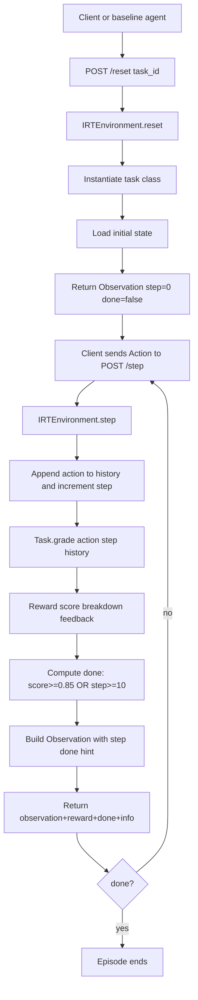
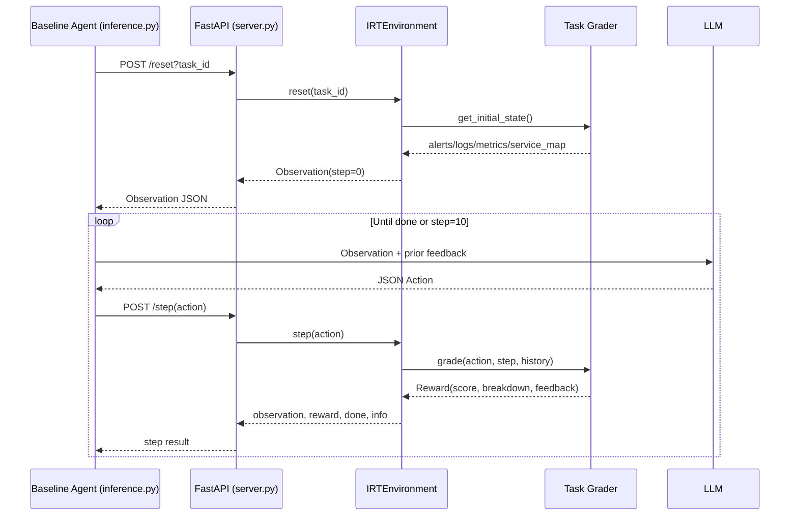
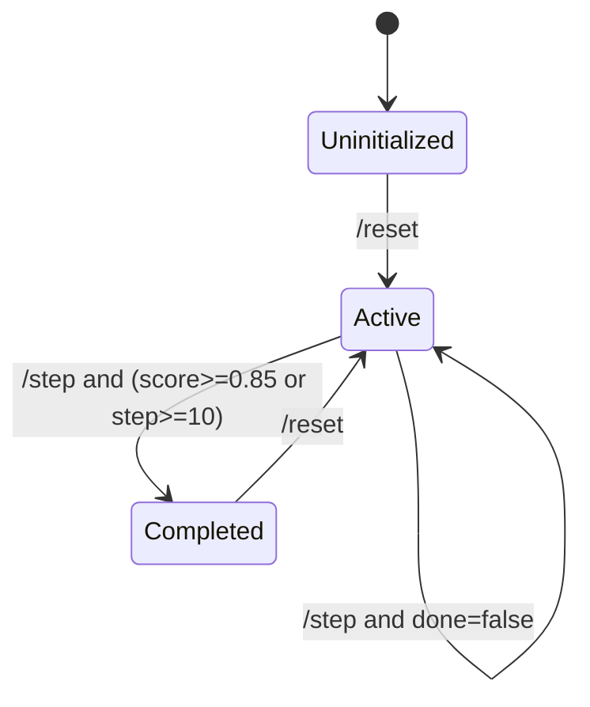

# Incident Response Triage: Detailed Environment Flow

## 1. Scope and Intent
This document explains what is happening in the environment end-to-end:
- How the baseline agent interacts with the API.
- How observations are produced.
- How each action type affects scoring.
- How rewards are accumulated and why an episode ends.
- How each task (easy, medium, hard) computes rewards.

This is intentionally focused in detail on core runtime files and concise on support files.

## 2. Core Runtime Components (Detailed)

### 2.1 API Layer
File: `server.py`
- Hosts FastAPI endpoints:
  - `POST /reset?task_id=...`
  - `POST /step`
  - `GET /state`
  - `GET /tasks`
  - `GET /health`
- Uses one global in-memory environment object (`IRTEnvironment`).
- `/reset` validates task id and initializes a new episode.
- `/step` accepts one `Action` and returns `{observation, reward, done, info}`.

### 2.2 Episode Engine
File: `environment.py`
- Owns episode state:
  - current task id
  - current task object
  - step counter
  - action history
  - max steps (default 10)
- `reset(task_id)`:
  - constructs task object from registry
  - zeroes counters/history
  - loads task initial state (alerts/logs/metrics/service_map)
- `step(action)`:
  - increments step
  - appends action to history
  - calls task-specific `grade(...)`
  - computes done as:

$$
\text{done} = (\text{reward.score} \ge 0.85) \lor (\text{step} \ge 10)
$$

- Observation is rebuilt each step with updated `step`, `done`, and optional `hint`.

### 2.3 Data Contracts
File: `models.py`
- `Observation` includes:
  - incident metadata
  - full alerts/logs/metrics/service_map
  - `step`, `max_steps`, `done`, optional `hint`
- `Action` supports:
  - `diagnose`, `remediate`, `query_logs`, `query_metrics`, `escalate`
- `Reward` includes:
  - `score` in [0, 1]
  - `breakdown` dictionary
  - `feedback`
  - optional canonical `correct_diagnosis`, `correct_remediation`

### 2.4 Task Registry
File: `tasks/__init__.py`
- Maps ids to classes:
  - `oom_crash` -> `OOMCrashTask`
  - `db_pool_exhaustion` -> `DBPoolTask`
  - `cascading_failure` -> `CascadingFailureTask`

### 2.5 Baseline Agent Driver
File: `inference.py`
- Loads environment variables (including `.env`).
- Chooses model credentials based on endpoint.
- For each task:
  1. calls `/reset`
  2. sends current observation to LLM
  3. receives JSON action
  4. posts action to `/step`
  5. feeds reward feedback back into the prompt loop
- Emits structured logs:
  - `[START]`, `[STEP]`, `[END]`, `[SUMMARY]`

## 3. Support Files (Concise)
- `openenv.yaml`: environment metadata, task catalog, action/observation text summary.
- `README.md`: usage and benchmark framing.
- `Dockerfile`: container startup (`uvicorn server:app` on port 7860).
- `requirements.txt`: pinned dependencies.

## 4. Live Runtime Snapshot (Captured)
Snapshot from the running server during analysis:
- `GET /health` -> `{ "status": "ok" }`
- `GET /tasks` -> `["oom_crash", "db_pool_exhaustion", "cascading_failure"]`
- `GET /state` showed an active `cascading_failure` episode with:
  - `step = 6`
  - `history_length = 6`
  - history included upstream investigation (`inventory-service`, `redis-cache`), then diagnosis/remediation transitions toward canonical root cause (`redis_disk_exhaustion` + `clear_redis_disk`).

Note: additional controlled calls were made after this snapshot to generate worked reward traces below.

## 5. Lifecycle Visualization

### 5.1 Reset/Step Flow

### 5.2 Agent/API/Task Sequence

### 5.3 Episode State Machine

## 6. Observation Semantics
At every step, the server returns an `Observation` with:
- Full alerts list (not delta-only)
- Full logs list (not filtered by `query_*`)
- Full metrics map
- Full dependency graph (`service_map`)
- Current `step`, `max_steps`, `done`
- Optional `hint` when:

$$
\text{step} \ge 5 \land \text{done} = \text{false}
$$

Current hint text (hardcoded in environment):
- "Hint: check the service furthest upstream in service_map."

## 7. Action Semantics and Effects

### 7.1 Functional Meaning by Action Type
- `query_logs`: agent claims a service to inspect logs for.
- `query_metrics`: agent claims a service to inspect metrics for.
- `diagnose`: submits root cause hypothesis.
- `remediate`: submits fix action.
- `escalate`: gives up.

### 7.2 Important Implementation Detail
`query_logs` and `query_metrics` do not dynamically filter observation payload in `environment.py`; task graders interpret these actions for scoring logic only.

## 8. Reward Model: Per-Task Formulas

## 8.1 Easy Task: OOM Crash (`task_easy.py`)
Stateful flags:
- `diagnosis_correct`
- `remediation_correct`

Base scoring:
$$
S = 0.5 \cdot I_d + 0.4 \cdot I_r
$$
where:
- $I_d=1$ if diagnosis matches OOM aliases.
- $I_r=1$ if remediation matches restart/heap-memory aliases.

Efficiency bonus when both are correct:
$$
B_{eff} = \max\left(0,\operatorname{round}\left(0.1\left(1-\frac{step-1}{5}\right),3\right)\right)
$$

Repeat penalty (only if previous action type equals current action type and type in {diagnose, remediate}):
$$
P_{repeat}=0.05
$$

Final:
$$
score = \operatorname{clip}_{[0,1]}(S + B_{eff} - P_{repeat})
$$

## 8.2 Medium Task: DB Pool Exhaustion (`task_medium.py`)
Stateful flags:
- `diagnosis_correct`
- `remediation_correct`
- `red_herring_hit` (if diagnosis blames CPU/compute)

Base:
$$
S = 0.5 \cdot I_d + 0.4 \cdot I_r
$$

Red-herring penalty (only while diagnosis still wrong):
$$
P_{rh}=0.1
$$

Efficiency (when both correct):
$$
B_{eff}=\max\left(0,\operatorname{round}\left(0.1\left(1-\frac{step-1}{6}\right),3\right)\right)
$$

Final:
$$
score = \operatorname{clip}_{[0,1]}(S + B_{eff} - P_{rh})
$$

## 8.3 Hard Task: Cascading Failure (`task_hard.py`)
Stateful flags:
- `diagnosis_correct`
- `remediation_correct`
- `investigated_redis` (set by `query_logs` or `query_metrics` targeting redis/cache)

Base:
$$
S = 0.5 \cdot I_d + 0.4 \cdot I_r
$$

If redis was investigated and diagnosis is not yet correct:
$$
S = \max(S, 0.15)
$$

Layer adjustment (only while diagnosis still wrong):
- diagnose API/gateway: $-0.15$
- diagnose order: $-0.05$
- diagnose inventory: $+0.05$

Applied as:
$$
S = \max(0, S + A_{layer})
$$

Efficiency (when both correct):
$$
B_{eff}=\max\left(0,\operatorname{round}\left(0.1\left(1-\frac{step-1}{8}\right),3\right)\right)
$$

Final:
$$
score = \operatorname{clip}_{[0,1]}(S + B_{eff})
$$

## 9. Per-Action Contribution Matrix

| Action Type | OOM Crash | DB Pool | Cascading Failure |
|---|---:|---:|---:|
| `query_logs` | usually 0.0 | usually 0.0 | can yield 0.15 if target is redis/cache and diagnosis not yet correct |
| `query_metrics` | usually 0.0 | usually 0.0 | can yield 0.15 if target is redis/cache and diagnosis not yet correct |
| `diagnose` correct | +0.5 | +0.5 | +0.5 |
| `diagnose` wrong-layer | no special layer rule | CPU blame can trigger -0.1 red-herring state | API/order/inventory adjustments (-0.15/-0.05/+0.05) while wrong |
| `remediate` correct | +0.4 | +0.4 | +0.4 |
| `escalate` | no positive contribution | no positive contribution | no positive contribution |
| both diag+rem done | +efficiency bonus | +efficiency bonus | +efficiency bonus |

## 10. Bonus and Penalty Timelines

### 10.1 Efficiency Bonus by Completion Step

| Completion Step | OOM bonus | DB bonus | Cascading bonus |
|---:|---:|---:|---:|
| 1 | 0.100 | 0.100 | 0.100 |
| 2 | 0.080 | 0.083 | 0.088 |
| 3 | 0.060 | 0.067 | 0.075 |
| 4 | 0.040 | 0.050 | 0.062 |
| 5 | 0.020 | 0.033 | 0.050 |
| 6 | 0.000 | 0.017 | 0.038 |
| 7+ | 0.000 | 0.000 | declines to 0 by step 9 |

### 10.2 Verified Edge Cases (from live calls)
- OOM repeat diagnose penalty verified:
  - first correct diagnose: 0.50
  - repeated diagnose next step: 0.45 with `repeat_penalty=-0.05`
- Cascading query_metrics on redis verified:
  - score: 0.15 with `upstream_investigation=0.15`
- Hint trigger verified:
  - at step 5 and not done, observation includes hint text.

## 11. Worked Examples (Live Traces)

### 11.1 OOM Crash Example
Reset summary:
- alerts: 2
- logs: 4
- services in metrics: `payment-service`

| Step | Action | Score | Breakdown | Feedback Summary |
|---:|---|---:|---|---|
| 1 | `query_logs(payment-service)` | 0.00 | `{}` | asks to inspect JVM heap/errors |
| 2 | `diagnose(memory_exhaustion)` | 0.50 | `{diagnosis:0.5}` | diagnosis accepted |
| 3 | `remediate(restart_service)` | 0.96 | `{diagnosis:0.5, remediation:0.4, efficiency_bonus:0.06}` | fully correct, episode done |

How 0.96 was achieved:
$$
0.5 + 0.4 + 0.06 = 0.96
$$

### 11.2 DB Pool Exhaustion Example
Reset summary:
- alerts: 2
- logs: 4
- services: `user-service`, `postgres-db`

| Step | Action | Score | Breakdown | Feedback Summary |
|---:|---|---:|---|---|
| 1 | `diagnose(cpu_bottleneck)` | 0.00 | `{red_herring_penalty:-0.1}` | CPU is red herring |
| 2 | `diagnose(db_connection_pool_exhausted)` | 0.50 | `{diagnosis:0.5}` | diagnosis accepted |
| 3 | `remediate(increase_connection_pool)` | 0.967 | `{diagnosis:0.5, remediation:0.4, efficiency_bonus:0.067}` | fully correct, episode done |

How 0.967 was achieved:
$$
0.5 + 0.4 + 0.067 = 0.967
$$

### 11.3 Cascading Failure Example
Reset summary:
- alerts: 3
- logs: 7
- services: `api-gateway`, `order-service`, `inventory-service`, `redis-cache`

| Step | Action | Score | Breakdown | Feedback Summary |
|---:|---|---:|---|---|
| 1 | `query_logs(redis-cache)` | 0.15 | `{upstream_investigation:0.15}` | partial credit for upstream focus |
| 2 | `diagnose(api_gateway_failure)` | 0.00 | `{upstream_investigation:0.15, layer_penalty:-0.15}` | wrong layer blame |
| 3 | `diagnose(redis_disk_exhaustion)` | 0.50 | `{diagnosis:0.5}` | diagnosis accepted |
| 4 | `remediate(clear_redis_disk)` | 0.962 | `{diagnosis:0.5, remediation:0.4, efficiency_bonus:0.062}` | fully correct, episode done |

How 0.962 was achieved:
$$
0.5 + 0.4 + 0.062 = 0.962
$$

## 12. Why Scores Persist Across Steps
Task graders store correctness flags on task instance state, not only current action. This means:
- A correct diagnosis at step N still contributes at step N+1.
- A correct remediation later combines with previous diagnosis to reach terminal score.
- Episode completion is therefore based on cumulative progress, not single-step isolated grading.

## 13. Practical Interpretation of What Is Happening
- The environment is an episodic controller over static incident snapshots.
- The agent is rewarded for:
  - identifying root cause (`diagnose`)
  - proposing root-level fix (`remediate`)
  - doing it quickly (efficiency bonus)
  - avoiding superficial blame (red-herring/layer penalties)
- In hard tasks, upstream reasoning is explicitly incentivized even before final diagnosis.

## 14. Appendix: Endpoint Quick Reference
- `POST /reset?task_id=<id>` -> starts episode, returns initial observation.
- `POST /step` with Action JSON -> returns observation, reward, done, info.
- `GET /state` -> current in-memory episode state and full action history.
- `GET /tasks` -> valid task ids.
- `GET /health` -> service health.
